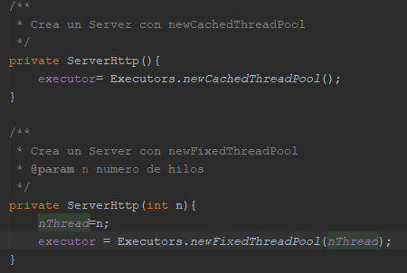

# Taller Concurrencia

Son ejercicios con sockets en java terminando con una implementación concurrente de un web server utilizando sockets, actualmente puede "servir" archivos de Imagenes y Texto (png, jpg, css, js, html).

## Autor

* **J. Eduardo Arias Barrera** - [AriasAEnima](https://github.com/AriasAEnima)


## Rendimiento LOC/h

Falta

### Prerrequisitos

Java JDK 1.8, Maven y Git.

* [JAVA JDK 8](http://www.oracle.com/technetwork/java/javase/overview/index.html) - Version de Java
* [Maven](https://maven.apache.org/) - Maven
* [JUnit 3.8.1](https://mvnrepository.com/artifact/junit/junit/3.8.1) - Para Pruebas


## Para empezar

Se debe ejecutar en la carpeta que queremos que esté
```
> git clone https://github.com/AriasAEnima/Taller-Concurrencia.git
```
### Instalación

Primero ejecutamos maven en la carpeta raíz, esto compilara el aplicativo

```
Taller-Concurrencia> mvn package
```
Este proceso durara entre 30-60 s , ya que correrá varias pruebas.

## Ejecución:

Para correr el servidor utilizaremos el comando siguiente:

```
java -cp target/Taller-Concurrencia-1.0-SNAPSHOT.jar edu.escuelaing.arsw.tallerconcurrencia.http.ServerHttp
```
Los archivos a probar deben estar en la carpeta /resources de la raíz

```
> Taller-Concurrencia\resources
```
Por ejemplo se utilizo una pagina de prueba llamada Boxify:


Y para probarlo podremos usar la URL:

**Nótese que NO está escrito */resources* en el path, el path de la URL debe ser relativo a resources.**

```
http://127.0.0.1:35000/Boxify/index.html
```


Y podremos ver como el servidor le llega peticiones y el Browser renderiza correctamente.


## Diseño Utilizado


Haciendo un recorrido de arriba hacia abajo:
* Se aplico un patron Singleton perezoso en el ServerHttp que solo cambia de instancia si se requiere un numero de hilos diferentes, sin embargo siempre será una única instancia.
* El server implementa Runnable para que en las pruebas no bloquee (pudo haberse creado una clase anonima Runnable con el Server pero opte por esto.).
* El server Http utiliza un pool de Threads Fixed (actualmente fijado en 7 si no se da este parametro). *Fixed con el fin de hacer pruebas interesantes cambiando este numero*


* Se creara un ClientSocketProcess por cada peticion particular que llegue.
* El pool de threads le dará "start" a los ClientSocketProcess.
* Los ClientSocketProcess utilizaran los servicios de ResourceChooser para escoger un ResourceWriter y ejecutarlo.
* Se agregó un Writer de error que puede ser utilizado por los otros cuando no encuentren el archivo o desde el chooser si no se soporta el tipo de archivo.


Esta implementación nos permite agregar mas ResourceWriters , lo agregamos en el map de Chooser y EchoServerHttp seguirá funcionando a la perfección.


### Pruebas especificas
Hice dos pruebas:
### 1) Escribí un código html, js y agregué una imagen.
Ingresamos la URL
```
> localhost:35000/prueba/index.html
```
Como podemos ver pide 3 recursos.


Y pide un cuarto que no implementamos


### 2) Descargue un paquete completo de una Pagina Web y mire que tal lo mostraba.

Ingresamos la URL
```
> localhost:35000/index.html
```

Como podemos ver pide muchos recursos.


## Documentación:

Se encuentra en la carpeta
```
> cd src/resources
```

## Bibliografía

The Thread Pool Pattern - DHolness. (2018, 14 mayo). Recuperado 13 de junio de 2020, de https://medium.com/@dholnessii/the-thread-pool-pattern-7227eb9ec2b6

## Licencia

This project is licensed under the MIT License  - see the [LICENSE](LICENSE) file for details


## Pruebas


## Circle CI :

[](https://circleci.com/gh/AriasAEnima/Taller-Concurrencia)
