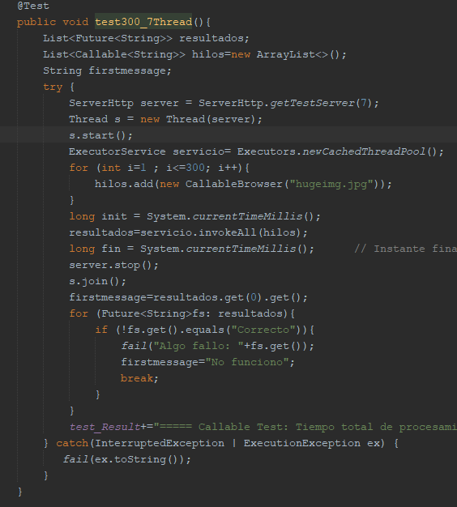

# Taller Concurrencia

Son ejercicios con sockets en java terminando con una implementación concurrente de un web server utilizando sockets, actualmente puede "servir" archivos de Imagenes y Texto (png, jpg, css, js, html).

Ya esta desplegado en Heroku:
https://safe-lowlands-73138.herokuapp.com/Boxify/index.html

## Autor

* **J. Eduardo Arias Barrera** - [AriasAEnima](https://github.com/AriasAEnima)


## Rendimiento LOC/h

Falta

### Prerrequisitos

Java JDK 1.8, Maven y Git.

* [JAVA JDK 8](http://www.oracle.com/technetwork/java/javase/overview/index.html) - Version de Java
* [Maven](https://maven.apache.org/) - Maven
* [JUnit 3.8.1](https://mvnrepository.com/artifact/junit/junit/3.8.1) - Para Pruebas


## Para empezar

Se debe ejecutar en la carpeta que queremos que esté
```
> git clone https://github.com/AriasAEnima/Taller-Concurrencia.git
```
### Instalación

Primero ejecutamos maven en la carpeta raíz, esto compilara el aplicativo

```
Taller-Concurrencia> mvn package
```
Este proceso durara entre 30-60 s , ya que correrá varias pruebas.

## Ejecución:

Para correr el servidor utilizaremos el comando siguiente:

```
java -cp target/Taller-Concurrencia-1.0-SNAPSHOT.jar edu.escuelaing.arsw.tallerconcurrencia.http.ServerHttp
```
Los archivos a probar deben estar en la carpeta /resources de la raíz

```
> Taller-Concurrencia\resources
```
Por ejemplo se utilizo una pagina de prueba llamada Boxify:


Y para probarlo podremos usar la URL:

**Nótese que NO está escrito */resources* en el path, el path de la URL debe ser relativo a resources.**

```
http://127.0.0.1:35000/Boxify/index.html
```


Y podremos ver como el servidor le llega peticiones y el Browser renderiza correctamente.


## Diseño Utilizado


Haciendo un recorrido de arriba hacia abajo:
* Se aplico un patron Singleton perezoso en el ServerHttp.
* El server implementa Runnable para que en las pruebas no bloquee (pudo haberse creado una clase anónima Runnable con el Server pero opte por esto.).
* El funcionamiento del server es un patron "Thread Pool".
* El server Http utiliza un newCachedThreadPool o un Fixed si se quiere. *Fixed con el fin de hacer pruebas interesantes cambiando este numero*.

**Implementacion del server con hilos:**  
Podemos observar que una vez termina la espera de una petición se crea un hilo y se inicia, no se espera que termine de procesar esta petición, en cambio se espera la siguiente petición y se crea otro hilo para que corra en paralelo si es necesario junto a peticiones anteriores.


* Se creara un ClientSocketProcess por cada petición particular que llegue.
* El pool de threads le dará "start" a los ClientSocketProcess.
* Los ClientSocketProcess utilizaran los servicios de ResourceChooser para escoger un ResourceWriter y ejecutarlo.
* Se agregó un Writer de error que puede ser utilizado por los otros cuando no encuentren el archivo o desde el chooser si no se soporta el tipo de archivo.


Al igual que el taller anterior ([Taller Networking](https://github.com/AriasAEnima/taller-networking)) , nos sigue prestando las mismas ventajas, ya que adicionamos patrones o classes manteniendo los patrones anteriores.


## Pruebas especificas:
#### Circle CI

[](https://circleci.com/gh/AriasAEnima/Taller-Concurrencia)

Se realizo pruebas una utilizando Callables como Browsers (300).

Logre capturar el posible error con un Array de Future <"String">, y utilice un invokeAll (newCachedThreadPool) para iniciarlos.

Los test consisten pedir como recurso una imagen de 6MB y cambiar los hilos que atienden en el Server (1 o 7); También verificar que si el Servidor da una respuesta negativa (por que no se encuentra el recurso o no se soporta), y una prueba pequeña podemos observar la respuesta del servidor de 3 tipos de archivos, (jpg, html y js).

Opte por que los browser no imprimieran la respuesta (excepto en la prueba pequeña), debido a que quería verificar la diferencia de tiempo del servidor cambiando los hilos que atendían, no de los browser (clientes) para leer la respuesta.

Aqui podemos el estilo de una prueba Callable:

En este ejemplo el servidor tendrá  7 hilos para atender 300 peticiones.



Los resultados en CircleCI:


Notamos una diferencia notable entre 7 y 1 hilo en el servidor de CircleCI.

## Comparando Hilos en el Server:

Me pareció una buena oportunidad de comprobar la conveniencia de aumentar hilos en un proceso, y pude notar por mi mismo que también aumentar indiscriminadamente los hilos no es una buena practica, ya que es posible que cueste mas instanciar y correr muchos hilos que la mismas tareas que deberían realizar. Y que posiblemente varié dependiendo del hardware y la peso de estas tareas.


## Documentación:

Se encuentra en la carpeta
```
> cd src/resources
```

## Bibliografía

The Thread Pool Pattern - DHolness. (2018, 14 mayo). Recuperado 12 de junio de 2020, de https://medium.com/@dholnessii/the-thread-pool-pattern-7227eb9ec2b6

Richard. (2017, 2 junio). Multitarea e Hilos en Java con ejemplos II (Runnable & Executors). Recuperado 12 de junio de 2020, de https://jarroba.com/multitarea-e-hilos-en-java-con-ejemplos-ii-runnable-executors/

Caules, C. Á. (2016, 8 diciembre). Java Callable Interface y su uso. Recuperado 13 de junio de 2020, de https://www.arquitecturajava.com/java-callable-interface-y-su-uso/


## Licencia

This project is licensed under the MIT License  - see the [LICENSE](LICENSE) file for details
